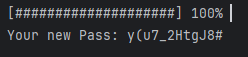

# Random Password Generator (sofoste-pass-gen)

## Overview

This project is a simple console-based random password generator written in Java. It generates a secure random password and simulates the generation process with a progress bar displayed in the console.

## Features

- Generates a random password with specified length.
- Displays a progress bar that updates gradually during the password generation process.
- Uses secure random number generation for better security.

## Usage

### Prerequisites

- Java Development Kit (JDK) installed on your system.

### Running the Application

1. Clone or download the repository to your local machine.
2. Navigate to the project directory.
3. Compile the Java files:
    ```sh
    javac de/tle/*.java
    ```
4. Run the `PassGenApp` class:
    ```sh
    java de.tle.PassGenApp
    ```

### Example Output

```plaintext
Generating |###############     | 85%
Generating |##################  | 95%
Generating |####################| 100%

Your new Pass: EsYAQFWdWzRD
```

## Code Structure

### PassGenApp.java
This is the main class that initiates the password generation process.
```
public class PassGenApp {

    public static Utils newPass = new Utils();

    public static void main(String[] args) throws InterruptedException {

        String genKey = newPass.generateRandomKey(12);

        System.out.println("\nYour new Pass: " + genKey);
    }
}
```

### Utils.java
This class contains the logic for generating the random password and displaying the progress bar.
```
public class Utils {

    private static final String CHARACTERS = "ABCDEFGHIJKLMNOPQRSTUVWXYZabcdefghijklmnopqrstuvwxyz0123456789!@#$%^&*()-_=+";
    private static final SecureRandom RANDOM = new SecureRandom();

    public String generateRandomKey(int length) throws InterruptedException {
        StringBuilder password = new StringBuilder(length);
        for (int i = 0; i <= 20; i++) {
            if (i < 20) {
                int index = RANDOM.nextInt(CHARACTERS.length());
                if (password.length() < length) {
                    password.append(CHARACTERS.charAt(index));
                }
            }
            displayProgress(i, 20);
            Thread.sleep(250); // Simulate some delay in generation
        }
        return password.toString();
    }

    private void displayProgress(int current, int total) {
        int percent = (int) ((current / (double) total) * 100);
        StringBuilder progress = new StringBuilder("[");

        for (int i = 0; i < total; i++) {
            if (i < current) {
                progress.append("#");
            } else {
                progress.append(" ");
            }
        }
        progress.append("] ").append(percent).append("% ");

        System.out.print("\r" + progress.toString());
    }
}
```

# License
This project is licensed under the MIT License - see the [LICENSE](LICENSE) file for details.

# Acknowledgements
Inspired by various console-based applications that visually display progress updates.


### LICENSE
```markdown
MIT License

Permission is hereby granted, free of charge, to any person obtaining a copy
of this software and associated documentation files (the "Software"), to deal
in the Software without restriction, including without limitation the rights
to use, copy, modify, merge, publish, distribute, sublicense, and/or sell
copies of the Software, and to permit persons to whom the Software is
furnished to do so, subject to the following conditions:

The above copyright notice and this permission notice shall be included in all
copies or substantial portions of the Software.

THE SOFTWARE IS PROVIDED "AS IS", WITHOUT WARRANTY OF ANY KIND, EXPRESS OR
IMPLIED, INCLUDING BUT NOT LIMITED TO THE WARRANTIES OF MERCHANTABILITY,
FITNESS FOR A PARTICULAR PURPOSE AND NONINFRINGEMENT. IN NO EVENT SHALL THE
AUTHORS OR COPYRIGHT HOLDERS BE LIABLE FOR ANY CLAIM, DAMAGES OR OTHER
LIABILITY, WHETHER IN AN ACTION OF CONTRACT, TORT OR OTHERWISE, ARISING FROM,
OUT OF OR IN CONNECTION WITH THE SOFTWARE OR THE USE OR OTHER DEALINGS IN THE
SOFTWARE.
```