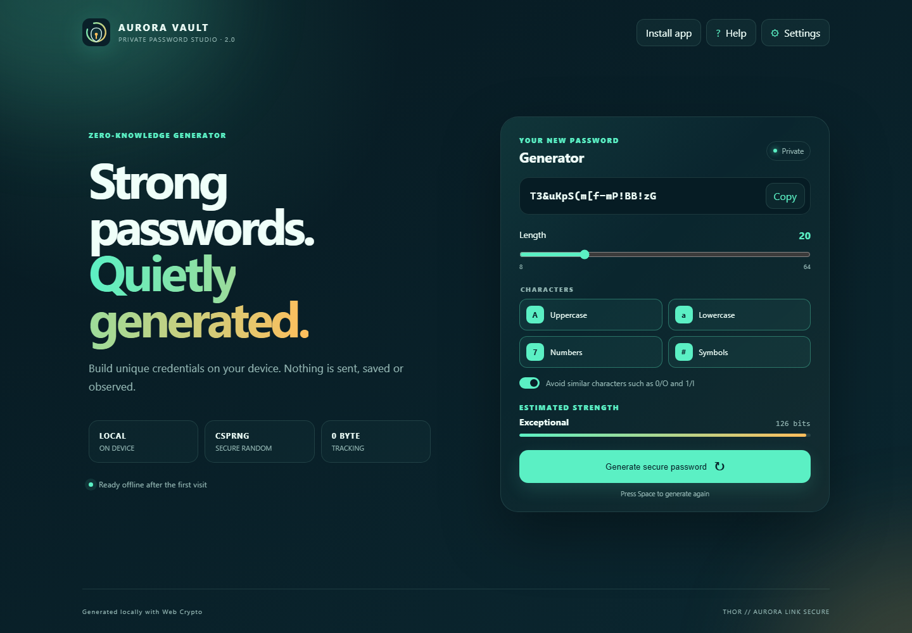
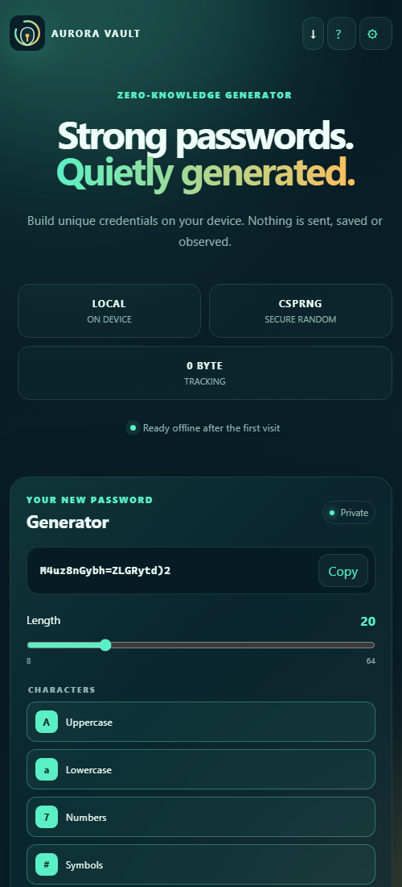

<p align="center">
  
</p>

<h1 align="center">Aurora Vault · Password Studio</h1>

<p align="center">
  A private password generator for desktop and mobile. Everything happens on your device.
</p>

<p align="center">
  <a href="https://sofoste93.github.io/sofoste-pass-gen/"><strong>Open the mobile app</strong></a>
  ·
  <a href="https://github.com/sofoste93/sofoste-pass-gen/releases/latest"><strong>Download for desktop</strong></a>
  ·
  <a href="#learning-map">Learn from the code</a>
</p>



## A simple vault with two doors

Aurora Vault 2.0 turns the original Java console exercise into two complementary applications:

- a polished Java desktop app with its own bundled runtime;
- an installable Progressive Web App for Android, iPhone, iPad and desktop browsers.

Both versions generate passwords locally. They never send, save, log or analyze generated values.

## Features

- Cryptographically secure randomness with Java `SecureRandom` and browser Web Crypto
- Uppercase, lowercase, number and symbol controls
- Guaranteed use of every selected character group
- Optional removal of ambiguous characters such as `0/O` and `1/l`
- Length from 8 to 64 in the interfaces and up to 128 through the Java engine
- Live entropy estimate and clear strength indicator
- English and German interface
- Aurora Night, Polar Day and system themes
- Reduced-motion setting, keyboard shortcut and accessible controls
- Offline PWA after the first visit
- No analytics, account, network API or password history

## On a phone

<p align="center">
  
</p>

Open [Aurora Vault online](https://sofoste93.github.io/sofoste-pass-gen/) from your phone.

- **Android / Chrome:** open the browser menu and choose **Install app** or **Add to Home screen**.
- **iPhone / Safari:** tap **Share**, then **Add to Home Screen**.

Once installed, the generator opens like a normal app and remains available offline. The generated password stays inside the current browser page until you replace or close it.

## Desktop downloads

Download the archive for your system from [GitHub Releases](https://github.com/sofoste93/sofoste-pass-gen/releases/latest). Each native package contains a private Java runtime, so Java does not need to be installed.

| System | Release asset | Launch |
|---|---|---|
| Windows 10/11 x64 | `Aurora-Vault-Windows-x64.zip` | `AuroraVault.exe` |
| Linux x64 | `Aurora-Vault-Linux-x64.tar.gz` | `bin/AuroraVault` |
| macOS Intel | `Aurora-Vault-macOS-x64.tar.gz` | `AuroraVault.app` |
| macOS Apple Silicon | `Aurora-Vault-macOS-arm64.tar.gz` | `AuroraVault.app` |

Windows SmartScreen and macOS Gatekeeper can warn about unsigned community applications. The SHA-256 file in every release lets you verify the download.

## Command line

The original console spirit remains available for scripts and learning:

```bash
java -jar aurora-vault.jar --cli --length 24 --count 3 --exclude-ambiguous
```

Run `java -jar aurora-vault.jar --help` for all options.

## Learning map

The code contains comments where the reasoning matters, especially around secure randomness and unbiased selection. Obvious syntax stays uncluttered so beginners can follow the flow.

| File | What it teaches |
|---|---|
| `PasswordPolicy.java` | Immutable configuration, records and validation |
| `PasswordGenerator.java` | `SecureRandom`, group coverage and Fisher-Yates shuffle |
| `PasswordStrength.java` | Entropy estimation with `log₂(pool size)` |
| `AuroraVaultFrame.java` | A dependency-free Swing interface and persisted preferences |
| `password-engine.js` | Web Crypto and rejection sampling without modulo bias |
| `app.js` | DOM events, localization, themes and PWA installation |
| `sw.js` | A small offline cache with a service worker |

The focused walkthrough in [docs/LEARNING_GUIDE.md](docs/LEARNING_GUIDE.md) explains how a click becomes a secure password in both implementations.

## Build and test

Requirements: JDK 17, Maven 3.9 and Node.js 20 or newer.

```bash
mvn clean verify
npm test
java -jar target/aurora-vault.jar --diagnostics
```

Run the desktop app:

```bash
java -jar target/aurora-vault.jar
```

Preview the PWA:

```bash
node scripts/serve.mjs
```

Create a native Windows bundle:

```powershell
powershell -ExecutionPolicy Bypass -File scripts/package.ps1
```

## Security scope

Aurora Vault uses secure operating-system randomness and avoids modulo bias in the web implementation. The strength label is a theoretical entropy estimate, not a promise that a website stores passwords safely. Use a different generated password for every account and keep it in a trusted password manager.

## License

Copyright © 2024-2026 Stephane Sob Fouodji. Released under the [MIT License](LICENSE).

**THOR // aurora link secure.** 🟢🛰️
